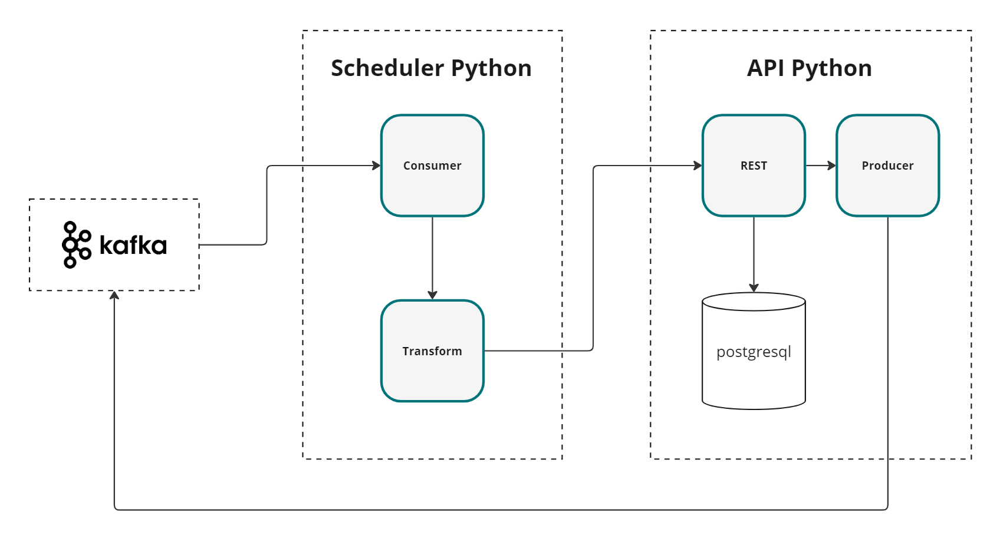

# Desafio

## 1. Cadastro de Produtos

- Crie um tópico no Kafka chamado cadastro-produtos.
- Manualmente, produza mensagens neste tópico com a seguinte estrutura JSON:

```json
{
  "productId": "12345",
  "productName": "Nome do Produto",
  "productDescription": "Descrição do Produto",
  "price": 100.0,
  "currency": "BRL",
  "stockQuantity": 50,
  "category": "Categoria do Produto"
}
```

## 2. Scheduler Python

- Crie uma aplicação Python que consuma mensagens do tópico cadastro-produtos.
- Transforme os dados conforme o modelo abaixo e envie os dados transformados via um endpoint REST da segunda aplicação:

```json
{
  "id": "12345",
  "name": "Nome do Produto",
  "description": "Descrição do Produto",
  "pricing": {
    "amount": 100.0,
    "currency": "BRL"
  },
  "availability": {
    "quantity": 50,
    "timestamp": "2024-06-12T12:00:00Z"
  },
  "category": "Categoria do Produto"
}
```

## 3. API Python

- Crie uma API REST em Python que receba os dados transformados via um endpoint.
- Persista os dados transformados em um banco de dados PostgreSQL com uma tabela apropriada para armazenar todas as
  informações recebidas.
- Produza os dados persistidos em um novo tópico no Kafka chamado produtos-persistidos com a mesma estrutura.

## 4. Entrega

- [x] Código-fonte das duas aplicações - Pode ser no git pessoal.
- [x] Arquivos de configuração necessários (Dockerfile, docker-compose, etc.).
- [x] Instruções para configuração e execução das aplicações.
- [x] Instruções para a criação e configuração dos tópicos no Kafka e da tabela no PostgreSQL.

# Instalação

## Network

- Crie a network default para os recursos:

```shell
docker network create default_network
```

## Serviços

- Para subir todos os serviços necessários com o Compose V2:

```shell
docker compose up -d
```

- Compose V1:

```shell
docker-compose up -d
```

### Kafka

O Kafka pode ser configurado através da UI (kafbat/kafka-ui), disponível por padrão em http://localhost:8080

- O tópico pode ser configurado nas aplicações através da variável de ambiente KAFKA_TOPIC (por padrão cadastro-produtos
  e produtos-persistidos, de acordo com a especificação)
- A UI também pode ser utilizada para criar a mensagem em "cadastro-produtos", iniciando o processo

### PostgresSQL

- Para alterar o nome do banco, é necessário alterar a variável POSTGRES_DB no Postgres <br>
  A API também pode ser configurada através da variável DB_NAME
- As migrations são rodadas automaticamente pela API, não há necessidade de criar a tabela

### API

> [!WARNING]
> A aplicação gera uma Exception e reinicia enquanto o Postgres não terminar de inicializar, esse comportamento é
> previsto.